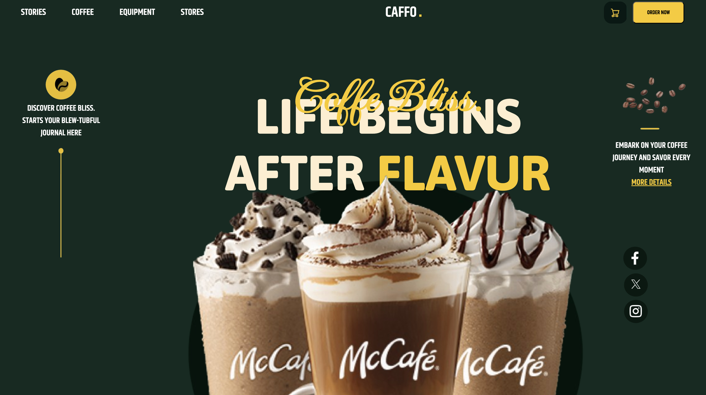
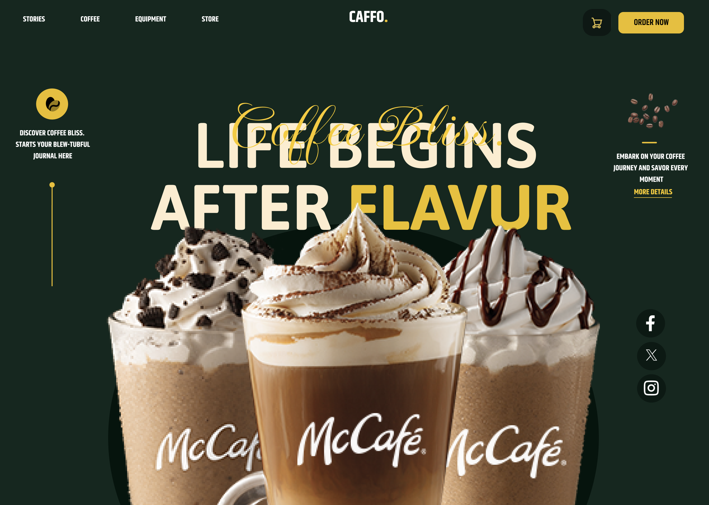

# Projeto-figma

Imagem da Webpage 

Imagem do Figma 

---
## Sobre
Site do tipo landing page para divulgar o McCafé. O intuito deste projeto é colocar em prática o conhecimento adquirido sobre as linguagens de marcação, HTML, CSS e Markdown, além de práticar a prototipagem do figma, no curso Técnico de Desenvolvimento de Sistemas do [SENAI JANDIRA](https://sp.senai.br/unidade/jandira/).

---
## Tecnologias utilizadas 
- HTML
- CSS
- Markdown 
- Figma 
- Git 

---
## Autor
- [Letícia Souza](https://www.linkedin.com/in/leticia-souza-almeida-84712a2b5/)